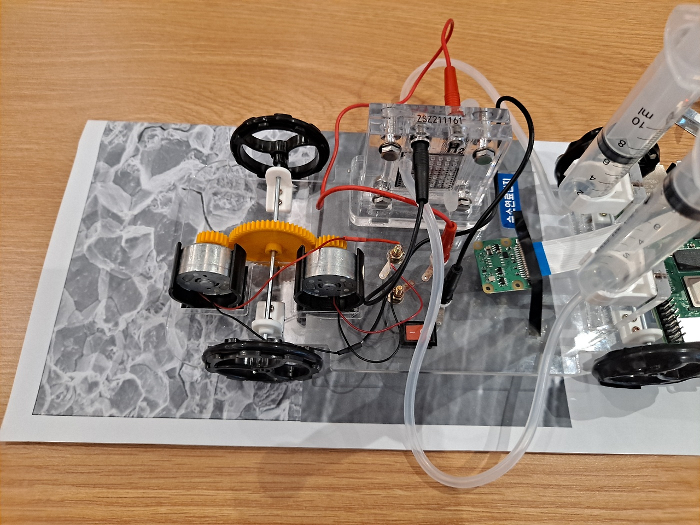

# 수소 취화 감지 및 AI 예측 웹 애플리케이션 개발
> 라즈베리파이를 이용한 수소 취화 감지 및 AI를 통한 파괴 예측 웹 애플리케이션 <br> 
> 관련 진행 사항 블로그: [제 2회 수소에너지 활용을 위한 임베디드 AI 해커톤 챌린지 캠프](https://blog-of-tifo.tistory.com/3)

## 결과
<p align="center">
 
</p>

> 제 2회 수소에너지 활용을 위한 임베디드 AI 해커톤 챌린지 캠프 (2024 08월 개최) 장려상 수상 <br>
> 관련 기사 url: [국립강릉원주대 스마트수소에너지사업단 ‘제2회 임베디드 AI 해커톤 챌린지 캠프’ 성료](https://kienews.com/news/newsview.php?ncode=1065578986227667)

---

## 목차

[1. 소개](#소개) <br>
[2. 역할 분배](#역할-분배) <br>
[3. 주요 기능](#주요-기능) <br>
[4. 시스템 아키텍쳐](#시스템-아키텍쳐) <br>
[5. 사용 언어 & 툴](#사용-언어--툴) <br>
[6. AI 모델 구현 로직](#ai-모델-구현-로직) <br>
[7. 서버](#서버) <br>
[8. 하드웨어 프로토타입](#하드웨어-프로토타입)


<br>

---

## 소개

<p align="center">
 
</p>

>  수소 취화율을 감지하고 예측하여 실험실 및 수소 관련 시설에서 효율적인 수소 관리를 돕는 혁신적인 AI 기반 애플리케이션을 개발하는 것입니다. 수소는 친환경 에너지원으로 주목받고 있지만, 안전한 관리를 위해서는 수소 취화 현상을 모니터링하고 적절히 대응하는 것이 필수적입니다. 수소 취화는 금속이 수소를 흡수하여 강도와 연성이 감소하는 현상으로, 수소를 저장하고 운송하는 과정에서 큰 위험 요소가 됩니다. 현재 수소 취화를 실시간으로 모니터링하고 예측할 수 있는 시스템은 부족한 상황입니다. 이를 해결하기 위해 우리는 수소 취화 감지 및 예측 시스템을 개발하여 수소 관련 시설의 안전성을 높이고, 운영 효율성을 극대화하고자 합니다.


<br>

---

## 역할 분배

|팀원|역할|
|---|:---:|
|김유정| 팀장, 서비스 기획, 하드웨어 설계, AI, 프론트엔드, 백엔드 |
|이현주| 서비스 기획, 발표, 발표 자료 제작, 하드웨어 설계 및 하드웨어 프로토타입 제작 |

<br>

---

## 주요 기능

> 1. 이미지 수집: 라즈베리파이 카메라 모듈을 통해 이미지 데이터 수집
> 2. 이미지 판별: 라즈베리파이에서 수집한 이미지 데이터를 AI 모델을 통해 수소 취화 정도를 판별
> 3. 모니터링 시스템: flask를 통해 수소 취화 여부 확인

<br>

---

## 시스템 아키텍쳐

<p align="center">
 
</p>

<br>

---

## 사용 언어 & 툴

### 프론트엔드

<p>
 
</p>

> Html: 모니터링 시스템 디스플레이

### 백엔드

<p>
 
 
</p>

> Python: AI 모델 

### 서버

<p>
 
 
</p>

> nginx: 라즈베리파이 -> python으로 이미지 데이터 수신  <br>
> flask: AI 모델에서 판별된 결과를 보여주는 서버

### 사용된 라이브러리

<p>
 
 
</p>

> opencv, tensorflow: 이미지 전처리 및 이미지 판별

<br>

---

## AI 모델 구현 로직

```
def create_model(input_shape):
    model = Sequential([
        Conv2D(32, (3, 3), activation='relu', input_shape=input_shape),
        MaxPooling2D(pool_size=(2, 2)),
        Conv2D(64, (3, 3), activation='relu'),
        MaxPooling2D(pool_size=(2, 2)),
        Flatten(),
        Dense(128, activation='relu'),
        Dropout(0.5),
        Dense(1, activation='sigmoid')  
    ])
    return model
```

> 이진 분류를 위한 시그모이드 활성화 함수

<br>

```
def predict_image(model, img):
    img = cv2.resize(img, (224, 224))
    img = img / 255.0  # 이미지 정규화
    img = np.expand_dims(img, axis=0)  # 배치 차원 추가
    
    prediction = model.predict(img)
    
    if prediction[0] > 0.5:
        return "수소 취화된 이미지"
    else:
        return "수소 취화되지 않은 이미지"
```
> 이미지 판별

<br>

---

## 서버
<p align="center">
 
</p>

> nginx 서버: 라즈베리파이에서 python으로 이미지 파일을 옮김

<br>

<p align="center">
 
</p>

> flask 서버: 수소취화 여부를 모니터링 가능

<br>

---

## 하드웨어 프로토타입

<p align="center">
 
</p>
<p align="center">
 
</p>

> [수소 자동차 키트](https://m.kjsci.com/goods/view?no=8295) 를 이용한 프로토타입 자동차 <br>
> 배관을 일일히 촬영할 수 없는 단점을 보완한 하드웨어 프로토타입 (김유정, 이현주 공동 제작 및 아이디어) <br>
> 자동차에 라즈베리파이를 부착 -> 라즈베리로 연결된 카메라 모듈로 이미지 수집 (카메라 모듈에 100배율 가능한 현미경 달음)

<br>

---


